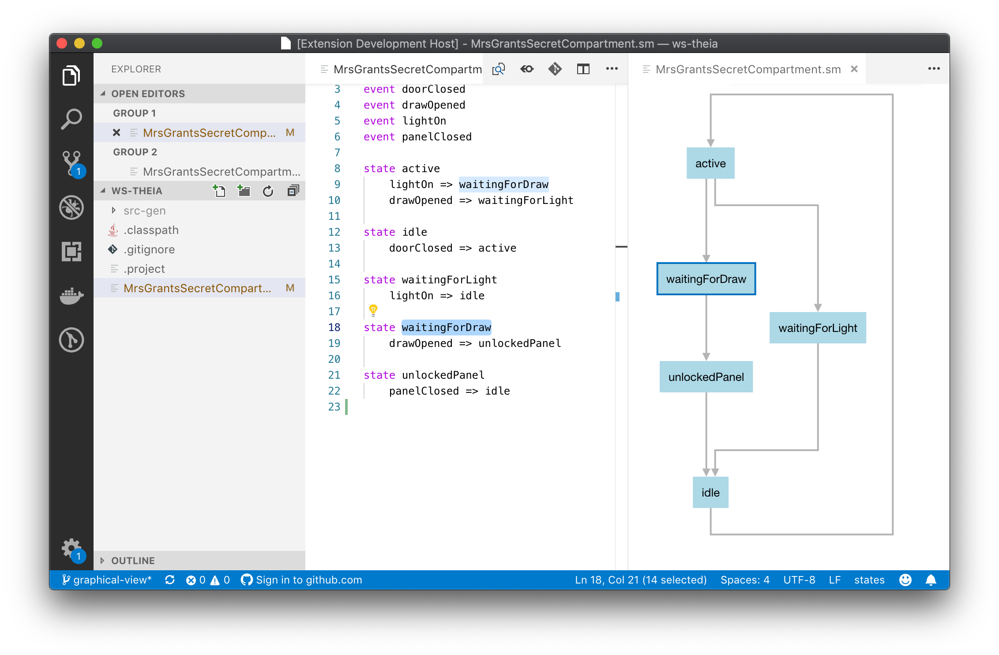

# sprotty-vscode

This repository contains the glue code to integrate [Sprotty diagrams](https://github.com/eclipse/sprotty) - with or without a language server - in VSCode extensions.

## Features

* running Sprotty diagrams in VS Code webviews,
* SVG export (ALT-E), animated center selection (ALT-C) and fit to screen (ALT-F) actions,
* interaction with Sprotty-enhanced language servers to automatically synchronize diagrams with language artifacts.

## Architecture

In VS Code, extensions can contribute new UI components using a webview. Webviews communicate 
with the extension using the `postMessage` API. The `SprottyVscodeExtension` use this to send and 
receive Sprotty Actions to and from a `SprottyWebview`. The latter runs a webpacked `bundle.js`
that contains the Sprotty diagram code.

If your extension provides a language, you can include a [Sprotty-enhanced language server]
(https://github.com/eclipse/sprotty-server) to get fully synchronized diagrams for your language
artifacts. The `SprottyVscodeLanguageExtension` acts as a relay between the language server and a 
`SprottyLanguageWebview`, and intercepts actions/LSP messages that 
require to interact with the VS Code workbench.

## Contents

The repo is structured as follows
- `example/`: an example using an Xtext-based Language Server and with Sprotty visualization.
- `extension/`: library code for the VSCode extension.
- `webview/`: library code for the script that is run in the webview.

